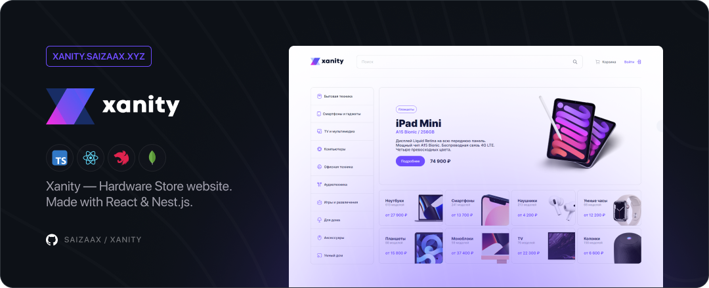

# Xanity — Hardware Store 💻

[](http://xanity.saizaax.dev/)
[](https://reactjs.org/)
[](https://www.typescriptlang.org/)
[](https://nestjs.com/)
[](https://www.mongodb.com/)
[](https://www.docker.com/)
[](https://github.com/features/actions)



<h3 align="center">
✨ Preview • <a href="https://xanity.saizaax.dev/">xanity.saizaax.dev</a>
</h3>

## Technologies

### Frontend
- `React.js`
- `TypeScript`
- `Stitches`
- `Axios`
- `React Router`

### Backend
- `Nest.js`
- `MongoDB`
- `JWT`
- `Passport`
- `Swagger`

<br>

## How to run

* Download & Install [Docker / Docker Desktop](https://www.docker.com/products/docker-desktop)

* Clone this repository
    ```bash
    git clone https://github.com/saizaax/xanity
    ```

* Open terminal and navigate to repository directory
    ```bash
    cd xanity
    ```

* Run docker-compose 
    ```bash
    docker-compose up --build --detach
    ```

* Open in web-browser
    ```bash
    http://localhost:80/
    ```

<br>

## Contacts

2022 • Korolkov Alexander • [@saizaax](https://t.me/saizaax) • [saizaax.off@gmail.com](mailto:saizaax.off@gmail.com)